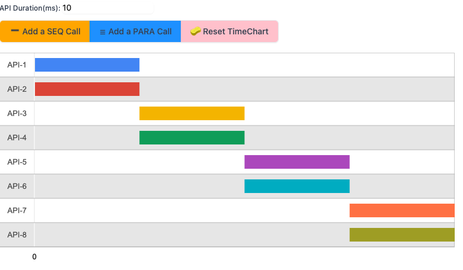

# service_timeline_modeling

To help you model your own service load pattern and estimate your service performance w/o testing it, feel what you can get out of exsiting APIs SLO, try to aline with your goal!!

Try it here: https://jsfiddle.net/a409kurd/1/
or paste the source code into https://jsfiddle.net/
> * copy index.html into HTML section
> * copy addService.js into js section
> * Just run it and add more services on your own.

Also you can quikcly setup a Sinatra server on your local to taste it, project folder structure has in this repo, you need to install Ruby(2 or 3), Sinatra, Haml and puma to get it ready!
